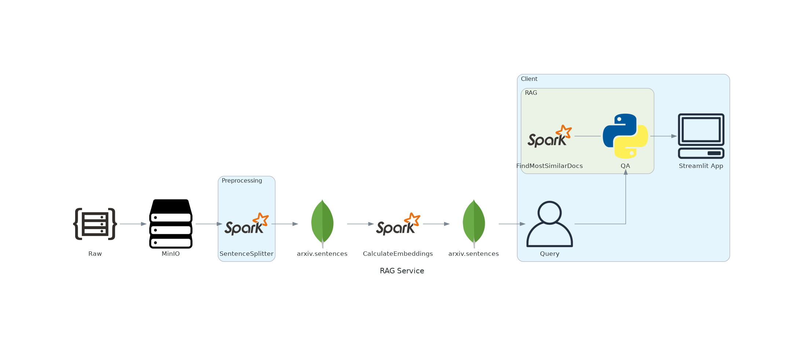

# pw-big-data-thesis

## Wprowadzenie.

Repozytorium towarzyszy pracy zaliczeniowej z przedmiotu: *Projektowanie rozwiązań Big Data* na kierunku: *Big Data - przetwarzanie i analiza dużych zbiorów danych* organizowanych przez Politechnikę Warszawską.

Celem projektu było stworzenie modułowego, skalowalnego i rozproszonego systemu umożliwiającego:
- przechowywanie dużego wolumenu danych o typie tekstowym,
- przetwarzanie wsadowe danych o typie tekstowych związane z przetwarzaniem mającym na celu sprowadzenie tekstu do postaci akceptowanej przez współczesne modele uczenia maszynowego,
- aplikowanie współczesnych metod przetwarzania języka naturalnego do przygotowania reprezentacji wektorowej danych o typie tekstowym,
- przygotowanie metod przeszukiwania dużego wolumenu danych tekstowych, które finalnie zasilają system Retrieval Augumented Generation (dalej: RAG).

## Demonstracja.

Część prezentacyjną uzupełnia interfejs graficzny umożliwiający komunikację z modelami uczenia maszynowego, tj. DistilBERT oraz Phi-3.

Poniżej przedstawiono film demonstrujący działanie systemu RAG:
- zadaniem było odnalezienie odpowiedzi na pytanie: *How many isomorphic classes of smooth Fano 6-polytopes are there?* (zagadnienie z dziedziny geometrii algebraicznej),
- w zakładce `QA` przedstawiono sposób działania modelu nie będącego Large Language Model a realizującego zadanie z sukcesem,
- w zakładce `LLM` przedstawiono sposób działania modelu klasyfikowanego jako Large Language Model w klasycznym dla RAG sposobie działania,
- wyniki porównano z wynikami uzyskiwanymi z wykorzystaniem najnowszej wersji modelu ChatGPT (GPT-4o).

Film demostrujący działanie systemu (YouTube):

[](http://www.youtube.com/watch?v=FI0_qMbdIYs "Demo Showdown: Locally Deployed LLM (RAG) vs. ChatGPT in Q&A Battle!")

## Architektura.

Poniżej przedstawiono schemat architektury systemu:



Architekturę definiuje `docker-compose.yml`.

## Struktura repozytorium.

Struktura:
- `data/` (ignorowany przez system kontroli wersji) powinien przechowywać surowe dane potrzebne do zasilenia systemu. Dane wykorzystane w projekcie mogą zostać pobrane z: [Kaggle](https://www.kaggle.com/datasets/Cornell-University/arxiv),
- `dockerfiles/` przechowuje definicje obrazów Docker definiujących usługi powiązane z Apache Spark oraz Jupyter Notebook,
- `models/` (ignorowany przez ystem kontroli wersji) przechowuje wykorzystywane modele uczenia maszynowego (offline), tj. `sentence-transformers/all-MiniLM-L6-v2`, `distilbert/distilbert-base-cased-distilled-squad` oraz `Phi-3-mini-4k-instruct-q4.gguf`.
- `notebooks/` przechowuje notatniki prezentujące wybrane fragmenty systemu,
- `src/` definiuje pakiet Pythonowy, który służy do interakcji z systemem za pośrednictwem CLI,
- `tex/` zawiera opis projektu na potrzeby zaliczenia przedmiotu.
- `docker-compose.yml` definiuje infrastrukturę wymaganą przez system RAG.

## CLI.

```
Usage: rag [OPTIONS] COMMAND [ARGS]...

Options:
  --help  Show this message and exit.

Commands:
  embeddings         Calculate embeddings.
  minio              Populate Minio with data.
  most-similar-docs  Get most similar documents.
  preprocessing      Preprocess data.
  qa                 Question & Answers.
```
